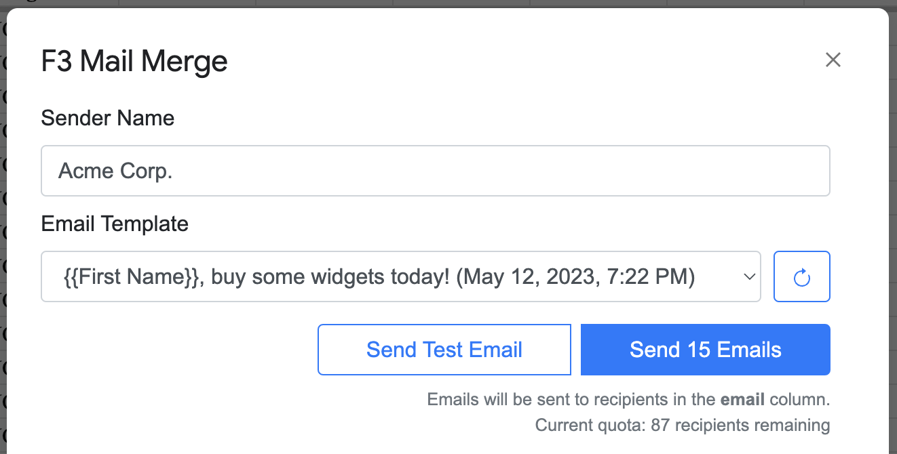

# F3 Mail Merge

Faiz's Fully Free Mail Merge (F3 Mail Merge) is a mail-merge tool for Gmail and Google Sheets.

It is freely licensed and will always be completely free to use without any restrictions
(except [those](https://developers.google.com/apps-script/guides/services/quotas) imposed by the Gmail API). No one
should have to pay a subscription fee
for a tool as simple as mail merge.

## Installation

Installation instructions will be added once F3 is published to the Add-ons store.

## Usage

Open a spreadsheet containing the data you want to mail-merge. Once F3 is installed,
you should see a new menu item called "F3 Mail Merge" in the toolbar.
Navigate to the sheet with your merge data on it and select "Start Mail Merge" to begin.
After a few seconds, you'll see a view like this:

The options are as follows:

- **Sender Name**: This is the name that will appear in the "From" field of the emails
  you send. It defaults to your email address, but you can change it to anything you want.
- **Email Template**: This is derived from the list of drafts in your Gmail account.
  Select the draft you want to use as the template for your mail merge. The draft
  should have placeholders for the data you want to insert in the body and/or subject.
  Placeholders are of the form `{{column_name}}`, where `column_name` is the name of
  the column in your spreadsheet that contains the data you want to insert.

## Limitations

To ensure that F3 stays free to use forever without creating a maintenance burden, it is subject
to a couple of limitations:

- F3 will not support link-tracking or open-tracking. These features are easy to implement
  but require a server to be maintained. This tool should work forever without any intervention
  on my part.
- No support or warranty is provided. If you discover a bug, please do file an issue and I
  will endeavor to fix it, but I make no promises.

Other than that, please enjoy using F3 Mail Merge (and your extra $20–200/year from not paying
for something else)! If you find it useful, please do share it with your friends and colleagues.

## Legal Stuff

The license can be found [here](https://github.com/ProbablyFaiz/f3-mailmerge/blob/master/LICENSE).
The privacy policy is [here](privacy.md).
